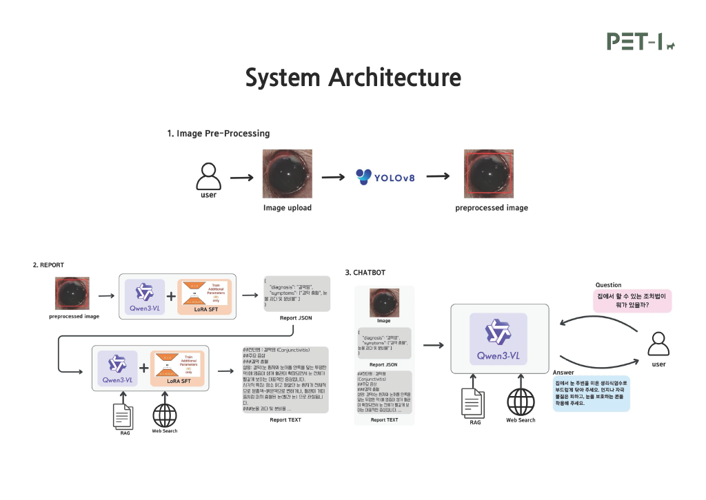

# 🐶 PET-I : Vision-Language Model 기반 반려견 안구 질환 조기 진단 솔루션

<br>
<div align="center">
  
</div>
<br>

<div align="center">
  
  
  
  
  
  
</div>

<br>

> **"우리 강아지 눈이 빨간데, 병원에 가야 할까요?"**
>
> PET-I는 단순 분류를 넘어, 질환의 원인과 대처 방법까지 **설명해주는(Explainable)** VLM 기반 AI 진단 서비스입니다.

---

## 📖 Project Overview

반려동물 인구 1,500만 시대, 안구 질환은 조기 발견이 어렵고 치료비 부담이 큽니다. 기존의 CNN 기반 진단 모델은 단순히 병명(Label)만 알려줄 뿐, "왜" 그런 진단이 나왔는지 설명하지 못했습니다.

**PET-I**는 최신 **Vision-Language Model (Qwen3-VL)**을 활용하여:
1.  반려견의 안구 이미지를 분석해 질환을 진단하고,
2.  판단 근거(시각적 증상)를 자연어로 설명하며,
3.  **RAG & Web Search**를 통해 보호자에게 전문적인 관리 가이드를 제공합니다.

* **진행 기간:** 2025. 03 ~ 2025. 12
* **참여 인원:** 4명 (AI/Backend 2, Frontend 1, Data/RAG 1)
* **주요 역할:** Data Pipeline 구축, VLM Fine-tuning, RAG/Web Search 구현, YOLO Pre-processing

---

## 🛠 System Architecture

이 프로젝트는 **Cloud Serverless (RunPod)** 환경에서 대규모 VLM을 효율적으로 서빙하는 End-to-End 파이프라인으로 구성되어 있습니다.



1.  **User (Flutter App):** 사진 업로드 및 챗봇 상담.
2.  **Gateway (FastAPI):** 요청 중계 및 데이터 전처리 관리.
3.  **AI Core (RunPod Serverless):**
    * **Pre-processing:** YOLOv8을 이용한 안구 영역 검출 (ROI Padding Crop).
    * **Inference:** Qwen3-VL-8B + LoRA (Low-Rank Adaptation).
    * **Retrieval:** RAG & Web Search를 통한 외부 지식 연동.

---

## 🧠 AI Methodology & Performance

### 1. Model: Qwen3-VL-8B + LoRA
* **Base Model:** Alibaba Qwen3-VL-8B (High-resolution image understanding).
* **Fine-tuning Strategy:** `Unsloth` 라이브러리를 활용한 4-bit Quantization 및 LoRA 적용으로 단일 A100 GPU(80GB) 환경에서 학습 최적화.
* **Data Augmentation:** Llama API 및 GPT API를 활용하여 AI-Hub 데이터셋(5,600장)에 대한 상세 증상 묘사 텍스트를 생성(Synthetic Data)하여 학습 데이터로 구축.

### 2. ROI Optimization (Padding Crop)
단순 안구 크롭 시 주변 문맥(눈물 자국, 피부 상태)이 소실되는 문제를 해결하기 위해, **YOLOv8** 탐지 후 주변부를 포함하는 **Padding Crop** 전략을 도입했습니다.
* 👉 **유루증(Epiphora) 진단 F1-Score: 0.35 → 0.48 향상**.

### 3. Performance Result
| Model | Accuracy | Note |
| :--- | :--- | :--- |
| **PET-I (Ours)** | **0.92** | *Periocular Issues Group (유사 병변 그룹 통합 기준)* |
| ResNet50 (Baseline) | 0.94 | 단순 이미지 분류 모델 |
| CLIP (Baseline) | 0.90 | 멀티모달 모델 |

* 전체 7개 클래스 세부 진단 정확도: **0.74** (F1-Score 0.7404).
* 기존 CNN 모델과 대등한 분류 성능을 보이면서도, **"설명 가능한 진단 리포트"**를 생성한다는 점에서 차별화된 경쟁력을 입증했습니다.

---

## 📂 Repository Structure

```text
PET-I/
├── ai/                      # AI Model Training & Evaluation
│   ├── main_model_train/    # Qwen-VL Fine-tuning Code (Unsloth, LoRA)
│   │   └── train.py         # Training Script
│   ├── notebooks/           # Data Preprocessing & Experiments
│   │   ├── image_preprocessing.ipynb
│   │   └── auto_ctx.py
│   ├── evaluation/          # Inference & Validation Code (vs ResNet, CLIP)
│   │   ├── validate.py
│   │   ├── clip_model.py
│   │   └── resnet50.py
│   ├── yolo_train/          # YOLO Training & Inference
│   │   └── yolo_train.ipynb
│   └── data/                # Sample Dataset
├── backend/                 # Serverless Backend
│   ├── src/                 # Handler, RAG Module, Web Search Logic
│   │   ├── handler.py
│   │   ├── analysis.py
│   │   └── rag_chatbot.py
│   ├── Dockerfile           # RunPod Environment Setup
│   └── requirements.txt
├── mobile/                  # Frontend Application (Flutter)
└── docs/                    # Documentation
    ├── PETI_final_report.pdf # Project Final Report
    └── Architecture.png     # System Diagram
```

---

## 🚀 Key Features

### 1. 📝 AI 진단 리포트 (Structured Diagnosis)
* 사용자가 업로드한 이미지를 분석하여 **진단명, 주요 증상, 관리 방법**이 포함된 구조화된 리포트를 제공합니다.
* **JSON 모드**와 **Markdown 모드**를 지원하여 시스템 연동성을 확보했습니다.

### 2. 💬 인터랙티브 챗봇 (Interactive Chatbot)
* 단순 진단에 그치지 않고, "집에서 어떻게 관리해?", "수술해야 해?"와 같은 질문에 답변합니다.
* **RAG (LangChain)**와 **Web Search (DuckDuckGo)**를 연동하여, 모델이 학습하지 않은 최신 수의학 정보까지 반영한 근거 있는 답변을 생성합니다.

### 3. ⚡ Serverless Serving
* RunPod Serverless를 도입하여 GPU 인스턴스를 상시 유지하지 않고 **요청 시에만 과금**되는 효율적인 아키텍처를 구현했습니다.

---

## 🔧 Trouble Shooting

> 개발 과정에서 겪은 주요 이슈와 해결 과정을 기록했습니다.

### Issue 1. [여기에 이슈 제목 입력]
* **Problem:** [문제 상황 기술]
* **Cause:** [원인 분석]
* **Solution:** [해결 방법 및 코드 수정 내용]

### Issue 2. [두 번째 이슈 제목]
* **Problem:** ...
* **Solution:** ...

---

## 👨‍💻 Author

**이호철 (Ho-Chul Lee)**

* Department of Computer Science & Engineering, Konkuk Univ.
* **Role:**
    * **AI Modeling:** Qwen3-VL Fine-tuning, LoRA Adapter Optimization.
    * **Data Engineering:** YOLOv8 Pre-processing, Data Augmentation using LLM.
    * **Backend Logic:** RAG (LangChain) & DuckDuckGo Search Integration.

* **Contact:** [이메일 주소 입력]
* **Portfolio:** [링크드인 주소 입력]

---

*※ 본 프로젝트의 상세한 내용은 [최종 보고서](docs/PETI_final_report.pdf)에서 확인하실 수 있습니다.*